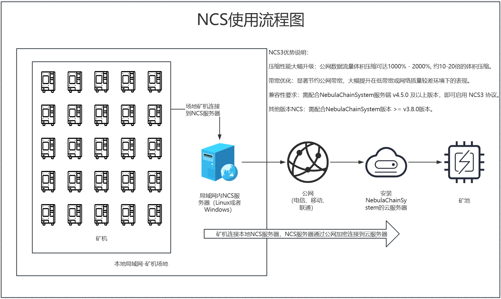

# NCS 使用指南

<h4 align="center">NCS用于挖掘数字虚拟货币的本地加密压缩解决方案</h4>

<p align="center">
    <a href="https://github.com/BernieMacMillan/NCS/releases">
        
    </a>
    <a href="https://t.me/NebulaChainSystem" target="_blank">
        
    </a>
    <a href="" target="_blank">
        
    </a>
    <a href="https://github.com/BernieMacMillan/NCS">
        
    </a>
</p>

<p align="center">
  <a href="https://berniemacmillan.gitbook.io/berniemacmillan/dai-li-chuan-tong-kuang-chi">矿池代理(抽水)</a> •
  <a href="https://berniemacmillan.gitbook.io/berniemacmillan/cheng-wei-kuang-chi-jie-dian">自建矿池</a> •
  <a href="https://github.com/BernieMacMillan/NCS">加密压缩</a> •
  <a href="https://berniemacmillan.gitbook.io/berniemacmillan">详细教程</a> •
  <a href="https://berniemacmillan.gitbook.io/berniemacmillan/nebulachainsystem-quan-bi-zhong-kuang-chi-jia-mi-xi-tong/fu-wu-xie-yi">服务协议</a> •
  <a href="https://berniemacmillan.gitbook.io/berniemacmillan/lian-xi-wo-men">免费定制</a>
</p>



## 全新 NCS3 发布

NCS3 相较于 NCS1、2 实现了全方位提升：
- 压缩性能大幅升级：公网数据流量体积压缩可达1000% - 2000%, 约10-20倍的体积压缩。
- 带宽优化：显著节约公网带宽，大幅提升在低带宽或网络质量较差环境下的表现。
- 兼容性要求：需配合 NebulaChainSystem 服务端 v4.5.0 及以上版本，即可启用 NCS3 协议。

重要提醒：请 NCS1、2 用户尽快切换至 NCS3。NCS1、2 在稳定性和效率上已全面落后于 NCS3, 并且NCS3不再兼容NCS1、2。

## 关于 NCS 客户端

NCS 安全客户端具备以下特点：
- 压缩连接数和数据，显著提高传输速度。
- 高安全性：防止中间人攻击和伪造请求。
- 多平台支持：
  - Linux
  - OpenWRT
  - Windows（图形化界面与命令行版本）

### 常见问题解答：
- [如何安装 NCS？](#安装指南)
  - [NCS3 Linux](#ncs3-linux-安装)
  - [NCS3 Windows](#ncs3-windows-安装)
  - [NCS2 Linux](#旧版ncs2安装)
  - [NCS2 Windows](#旧版ncs2图形化界面版本)
  - [NCS1 Linux](#旧版ncs1安装)
  - [NCS1 Windows](#旧版ncs1图形化界面版本)
- [Windows 图形界面版本白屏如何解决？](#windows-图形界面版本白屏)
- [什么是连接池模式？](#什么是连接池模式)
- [如何更改默认网页访问端口？](#如何更改默认网页访问端口)
- [如何设置 NCS 访问账号密码？](#如何设置-ncs-访问账号密码)
- [如何配置 NCS 一对多服务器？](#我想-ncs-一对多服务器如何使用)

# 安装指南

## NCS3 Linux 安装

运行以下命令即可安装：

- 线路1（GitHub 官方地址，若无法访问请使用其他线路）：

```
bash <(curl -s -L https://raw.githubusercontent.com/BernieMacMillan/NCS/main/install.sh)
```

- 线路2：

```
bash <(curl -s -L -k https://gh-proxy.com/https://github.com/BernieMacMillan/NCS/blob/main/install.sh)
```
```
bash <(curl -s -L -k https://hk.gh-proxy.com/https://github.com/BernieMacMillan/NCS/blob/main/install.sh)
```
```
bash <(curl -s -L -k https://cdn.gh-proxy.com/https://github.com/BernieMacMillan/NCS/blob/main/install.sh)
```

## OpenWRT 安装

使用以下命令安装：

- 线路1（GitHub 官方地址，若无法访问请使用其他线路）：

```
wget -N https://raw.githubusercontent.com/BernieMacMillan/NCS/main/install.sh; chmod +x ./install.sh; ./install.sh
```

- 线路2：

```
wget -N https://gh-proxy.com/https://github.com/BernieMacMillan/NCS/blob/main/install.sh; chmod +x ./install.sh; ./install.sh
```
```
wget -N https://hk.gh-proxy.com/https://github.com/BernieMacMillan/NCS/blob/main/install.sh; chmod +x ./install.sh; ./install.sh
```
```
wget -N https://cdn.gh-proxy.com/https://github.com/BernieMacMillan/NCS/blob/main/install.sh; chmod +x ./install.sh; ./install.sh
```

注意：由于 OpenWRT 版本众多，脚本可能无法兼容所有版本。如遇问题，请手动下载适配的二进制文件进行安装。

## NCS3 Windows 安装

### 图形化界面版本
- 下载地址：  

- 线路1（GitHub 官方地址，若无法访问请使用其他线路）：


  https://github.com/BernieMacMillan/NCS/raw/main/windows-gui/ncs.exe


- 线路2：


  https://gh-proxy.com/https://github.com/BernieMacMillan/NCS/blob/main/windows-gui/ncs.exe


  https://hk.gh-proxy.com/https://github.com/BernieMacMillan/NCS/blob/main/windows-gui/ncs.exe


  https://cdn.gh-proxy.com/https://github.com/BernieMacMillan/NCS/blob/main/windows-gui/ncs.exe

  
- 如遇白屏问题，请安装 WebView2：  

- 线路1（GitHub 官方地址，若无法访问请使用其他线路）：

  https://github.com/BernieMacMillan/NCS/raw/main/windows-gui/MicrosoftEdgeWebview2Setup.exe

- 线路2：

  https://gh-proxy.com/https://github.com/BernieMacMillan/NCS/raw/main/windows-gui/MicrosoftEdgeWebview2Setup.exe

  https://hk.gh-proxy.com/https://github.com/BernieMacMillan/NCS/raw/main/windows-gui/MicrosoftEdgeWebview2Setup.exe

  https://cdn.gh-proxy.com/https://github.com/BernieMacMillan/NCS/raw/main/windows-gui/MicrosoftEdgeWebview2Setup.exe

### 非图形化命令行版本
- 下载地址：

- 线路1（GitHub 官方地址，若无法访问请使用其他线路）：

  https://github.com/BernieMacMillan/NCS/raw/main/windows-no-gui/ncs.exe

- 线路2：
  
  https://gh-proxy.com/https://github.com/BernieMacMillan/NCS/raw/main/windows-no-gui/ncs.exe

  https://hk.gh-proxy.com/https://github.com/BernieMacMillan/NCS/raw/main/windows-no-gui/ncs.exe

  https://cdn.gh-proxy.com/https://github.com/BernieMacMillan/NCS/raw/main/windows-no-gui/ncs.exe

## 旧版NCS2安装

运行以下命令即可安装旧版NCS2：

- 线路1（GitHub 官方地址，若无法访问请使用其他线路）：

```
bash <(curl -s -L https://raw.githubusercontent.com/BernieMacMillan/NCS/main/NCS_2/install.sh)
```

- 线路2：

```
bash <(curl -s -L -k https://gh-proxy.com/https://github.com/BernieMacMillan/NCS/blob/main/NCS_2/install.sh)
```
```
bash <(curl -s -L -k https://hk.gh-proxy.com/https://github.com/BernieMacMillan/NCS/blob/main/NCS_2/install.sh)
```
```
bash <(curl -s -L -k https://cdn.gh-proxy.com/https://github.com/BernieMacMillan/NCS/blob/main/NCS_2/install.sh)
```

### 旧版NCS2图形化界面版本
- 下载地址：  
  https://github.com/BernieMacMillan/NCS/raw/main/NCS_2/windows-gui/NCS.exe
  
- 如遇白屏问题，请安装 WebView2：  
  https://github.com/BernieMacMillan/NCS/raw/main/NCS_2/windows-gui/MicrosoftEdgeWebview2Setup.exe

### 非图形化命令行版本
- 下载地址：  
    https://github.com/BernieMacMillan/NCS/raw/main/NCS_2/windows-no-gui/NCS.exe


## 旧版NCS1安装

运行以下命令即可安装旧版NCS1：

- 线路1（GitHub 官方地址，若无法访问请使用其他线路）：

```
bash <(curl -s -L https://raw.githubusercontent.com/BernieMacMillan/NCS/main/NCS_1/install.sh)
```

- 线路2：

```
bash <(curl -s -L -k https://gh-proxy.com/https://github.com/BernieMacMillan/NCS/blob/main/NCS_1/install.sh)
```
```
bash <(curl -s -L -k https://hk.gh-proxy.com/https://github.com/BernieMacMillan/NCS/blob/main/NCS_1/install.sh)
```
```
bash <(curl -s -L -k https://cdn.gh-proxy.com/https://github.com/BernieMacMillan/NCS/blob/main/NCS_1/install.sh)
```

### 旧版NCS1图形化界面版本
- 下载地址：  
  https://github.com/BernieMacMillan/NCS/raw/main/NCS_1/windows-gui/NCS.exe
  
- 如遇白屏问题，请安装 WebView2：  
  https://github.com/BernieMacMillan/NCS/raw/main/NCS_1/windows-gui/MicrosoftEdgeWebview2Setup.exe

### 非图形化命令行版本
- 下载地址：  
    https://github.com/BernieMacMillan/NCS/raw/main/NCS_1/windows-no-gui/NCS.exe


# 使用指南

### 如何使用？
1. 安装完成后，使用浏览器访问安装 NCS 客户端设备的 IP 地址（如 http://设备IP:42703）。
2. 进入网页后，填写推送地址即可。

建议：
- 请固定 NCS 安装设备的局域网 IP 地址。如果路由器使用 DHCP 动态分配 IP，可能导致设备重启后 IP 发生变化。

# 常见问题解答

### Windows 图形界面版本白屏

请安装 windows-gui 目录中的 MicrosoftEdgeWebview2Setup.exe 文件解决。

### 什么是连接池模式？

连接池模式是 NCS 的一项优化功能，可压缩 NCS 客户端至 NebulaChainSystem 服务器的公网 TCP 连接数。

- 开启条件：需要 NebulaChainSystem 服务端 v3.8.0 及以上版本（NCS1、2>=v3.8.0；NCS3>=v4.5.0）。
- 功能特点：并非简单地将矿机合并为一台设备，而是压缩中间公网 TCP 连接数量。矿池内矿机数量保持不变。

压缩率计算公式：
「压缩率 = 接入矿机数量 / 最大连接数」
建议：
- 压缩率不要过高。通常 3-5 倍压缩率较为理想，具体配置需视 NCS 设备和服务器性能而定。

### 如何更改默认网页访问端口？

1. 打开非图形界面版本的 NCS 安装目录。
2. 修改 conf 文件中的 PORT 配置项为所需端口。
3. 保存后重启程序即可生效。

### 如何设置 NCS 访问账号密码？

1. 在网页右上角，进入 设置 菜单。
2. 选择 设置用户名密码 进行配置。

### 我想 NCS 一对多服务器如何使用？

NCS 提供手动添加服务器功能：
1. 在 NCS 客户端内，选择 手动添加。
2. 按提示输入远程服务器地址即可完成配置。

<div align="center">
  <a href="#top">
    
  </a>
</div>